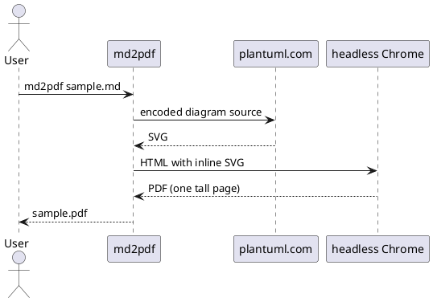

# Sample document

This file exercises everything `md2pdf` handles: GitHub-flavored Markdown plus
`plantuml` fences that are rendered server-side and inlined as SVG.

## A sequence diagram



## Ordinary Markdown

Tables, code and lists all render through `@deno/gfm`:

| Option       | Default | Notes                        |
| ------------ | ------- | ---------------------------- |
| `--width`    | 900     | Content column width, in px  |
| `--override` | off     | Overwrite an existing output |

```ts
import { mdToPDF } from "../mod.ts";

await mdToPDF("examples/sample.md", "sample.pdf");
```

- [x] Diagrams fetched in parallel
- [x] One page, no breaks
- [ ] Your document here

> A diagram that fails to render is left in the PDF as plain text, and reported
> at the end of the run.
